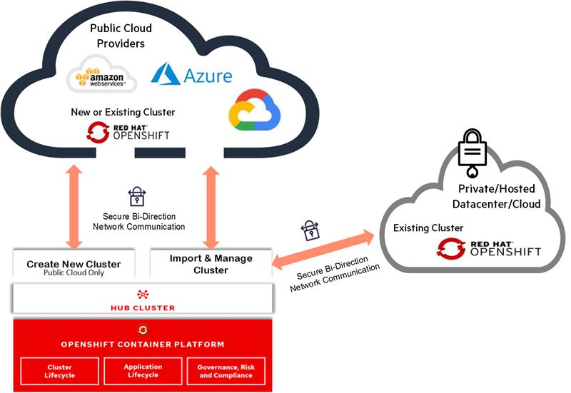
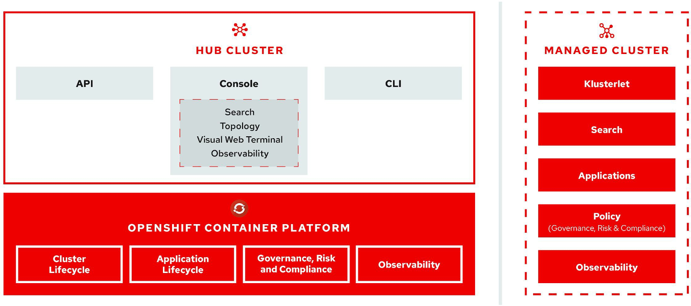

## Introduction

Hello there, fellow tech enthusiasts! Nick Miethe here, your resident OpenShift expert and the meat behind [MeatyBytes](/). As someone who's been diving deep into [OpenShift](/topics/openshift/), [Platform Engineering](/topics/platform-engineering/), and [DevOps](/tags/devops/), I'm thrilled to bring you the latest and greatest (at least within my train of thought) from the technology world.

Today, we're continuing our [introduction]() of **Red Hat's Advanced Cluster Management** (*ACM*) with a closer look at its technical components and its transformative role in the Hybrid Cloud landscape. As the Hybrid Cloud becomes increasingly central to modern computing, understanding and leveraging the strengths of **ACM** could be the difference between an 'OK' and an *'Outstanding'* cloud strategy. If you're keen on staying ahead in the cloud race, **ACM** deserves your attention.

### Synopsis

In this post, we'll not only explore the technical specifics of **ACM**, including those from the upstream **OCM**, but also explain **ACM Lifecycles**: the methods with which **ACM** performs its many tasks. We'll uncover how it shapes the Hybrid Cloud environment and propels you toward successful cloud operations. With its remarkable capabilities, **ACM** is not just a tool, but a key strategic asset in the rapidly evolving cloud landscape.

Stay with me, as we deep dive into the world of **ACM**, learn its ins and outs, and see how it can bring about a difference in your Hybrid Cloud strategy.

## Understanding ACM Components

**ACM** is composed of various components, many of which are derived from the **Open Cluster Management** (*OCM*) project:

### Components from OCM

#### 1. Cluster Manager

The `Cluster Manager` is the central control plane for managing all clusters. It is the touchpoint for cluster lifecycle management, controlling creation, update, and deletion of clusters.

#### 2. Klusterlet

`Klusterlet` is a component that lives on each managed cluster, acting as the agent for the `Cluster Manager`. It's responsible for maintaining a communication link back to the `Cluster Manager` and executing commands on its behalf.

#### 3. ManagedCluster

`ManagedCluster` is a representation of a cluster that the `Cluster Manager` controls. It allows the `Cluster Manager` to maintain an inventory of all managed clusters.

### Unique Components to ACM

On top of the above **OCM** components are others that are unique to **ACM**:

#### 1. Application Manager

This **ACM**-specific component enables application deployment and lifecycle management. It works in conjunction with the `Cluster Manager`, using a GitOps approach to ensure that desired state configurations are met.

#### 2. Policy Controller

The `Policy Controller` enforces policy governance across all managed clusters. It periodically checks compliance with defined policies and remediates non-compliant clusters.

#### 3. Search Collector

The `Search Collector` aggregates data across all managed clusters, making it available for querying from a central location. This functionality is crucial for providing insights and maintaining visibility across the entire hybrid cloud.

## ACM in Action: Hybrid Cloud Management

To better understand how these components work together, let's consider an example hybrid cloud environment. We'll have clusters spread across various clouds, such as *Amazon Web Services (AWS)* and *Google Cloud Platform (GCP)*, plus an on-premise data center.

1. The **Cluster Manager** maintains an overview of all clusters in AWS, GCP, and on-premise. Each of these clusters has a corresponding `ManagedCluster` resource.

2. On each of these clusters, the **Klusterlet** acts as the agent, executing commands issued by the `Cluster Manager` and reporting the status back.

3. The **Application Manager** deploys applications across these clusters, keeping track of their states, and ensuring that they conform to the desired configurations.

4. The **Policy Controller** applies policies across all clusters, continually checking for compliance, and taking remediation action when necessary.

5. The **Search Collector** gathers data from all clusters and makes it available for querying, thus ensuring visibility across the entire hybrid cloud setup.

## Lifecycle Management with ACM

When it comes to managing **OpenShift Container Platform (OCP)** clusters, **Advanced Cluster Management (ACM)** takes a **lifecycle-based** approach. In essence, it oversees three essential lifecycles: *clusters*, *applications*, and *governance*. Let's delve into how **ACM** orchestrates these critical processes.

### Cluster Lifecycle

The **cluster lifecycle** in **ACM** involves the creation, management, and deletion of OpenShift clusters across diverse infrastructures.

1. **Creation:** ACM enables you to define the desired characteristics of a cluster and then automates the creation process. This approach eliminates manual steps and ensures consistency.

2. **Management:** Once the clusters are operational, ACM oversees their maintenance. This oversight includes monitoring the health of the clusters, applying necessary updates, and scaling the clusters based on demand.

3. **Deletion:** When a cluster is no longer needed, ACM facilitates its safe decommissioning. This process includes data cleanup and resource de-allocation.

### Application Lifecycle

**Application lifecycle** management revolves around the deployment, update, scaling, and deletion of applications across multiple clusters.

1. **Deployment:** ACM leverages a GitOps-based approach for application deployment. By defining the desired state in a Git repository, ACM ensures that the actual state of the application matches the declared state.

2. **Update:** When an application needs to be updated, the changes are made in the Git repository. ACM detects these changes and rolls out the updates across all relevant clusters.

3. **Scaling:** Based on predefined rules or triggers, ACM can automatically scale applications to meet fluctuating demand.

4. **Deletion:** When an application is no longer needed, ACM handles the cleanup process. This process includes deleting the application instances and freeing up the resources they were using.

### Governance Lifecycle

The **governance lifecycle** refers to the creation, enforcement, and management of policies across all managed clusters.

1. **Creation:** ACM allows the creation of policy objects that define desired configurations or settings across clusters.

2. **Enforcement:** Once policies are defined, ACM ensures they're enforced. It continually checks all managed clusters for compliance and can automatically remediate any non-compliance issues.

3. **Management:** ACM oversees the entire policy lifecycle, from creation to deletion. If a policy is updated or removed, ACM ensures the changes are propagated across all managed clusters.

## Conclusion

The technical depth of **Advanced Cluster Management (ACM)**, combined with its components from **OCM** and those unique to it, provides a comprehensive solution for managing multi-cluster environments in a hybrid cloud. Each component plays a vital role in its ability to seamlessly orchestrate the cluster, application, and governance lifecycles in an OpenShift or Kubernetes environment.

By automating these critical processes and enabling policy enforcement and data aggregation, **ACM** minimizes manual intervention, reduces errors, and ensures consistency across diverse infrastructures.

## References

1. [ACM Documentation](https://access.redhat.com/documentation/en-us/red_hat_advanced_cluster_management_for_kubernetes/)
2. [OCM GitHub](https://github.com/open-cluster-management-io)
3. [A Guide to Cluster Landing Zones for Hybrid and Multi-cloud Architectures](https://cloud.redhat.com/blog/a-guide-to-cluster-landing-zones-for-hybrid-and-multi-cloud-architectures)
4. [Using the Open Cluster Management Placement for Multicluster Scheduling](https://cloud.redhat.com/blog/using-the-open-cluster-management-placement-for-multicluster-scheduling)
5. [How to distribute workloads using Open Cluster Management | Red Hat Developer](https://developers.redhat.com/articles/2023/01/19/how-distribute-workloads-using-open-cluster-management)
