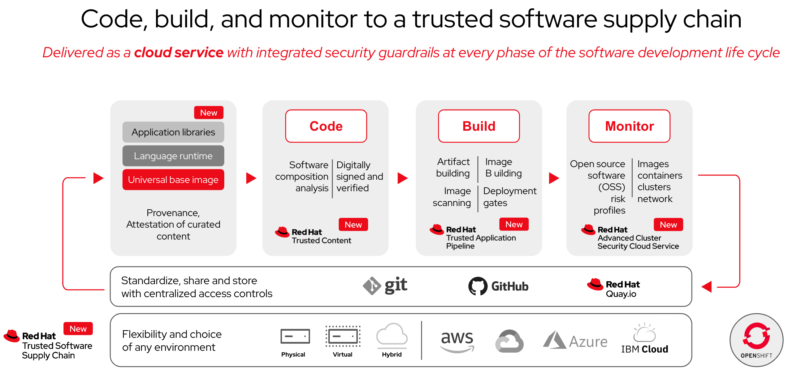

## Introduction

Security has become paramount in today's world of software development. With the increased use of open-source components and rapid deployment processes, software supply chain security has become a crucial element to ensure robust and secure applications. This past week during Red Hat Summit, RH unveiled its Trusted Software Supply Chain, a promising service aiming to revolutionize software supply chain security. In this post, we'll delve into this new offering, exploring its services and underlying technologies. Then, we'll compare it at face-value with other industry-leading tools, specifically focusing on Chainguard for this post.

## Understanding Red Hat's Trusted Software Supply Chain

**Red Hat's Trusted Software Supply Chain** is a cloud service designed to accelerate the integration of software supply chain security into cloud-native applications. It provides a comprehensive suite of tools to ensure security from coding to deployment, all within a managed service that can sit alongside your existing platform.


**Hosting Options** I asked Tushar Katarki, the Product Director for OpenShift, during RH Summit about self-managed instances of Trusted Software Supply Chain, and he mentioned that it will be released soon!


### What It Offers

**Red Hat's Trusted Software Supply Chain** primarily offers five functionalities:

1. **Integrated Application Security Checks**: More than two-thirds of application code is derived from open source dependencies. Red Hat provides curated builds and hardened open source libraries with provenance checks to help remove malicious code and proactively analyze vulnerabilities. This feature also includes out-of-the-box plugins to your IDE for certification of your code before pushing into commit.

2. **Security-focused CI/CD Workflows**: The service includes **Red Hat Trusted Application Pipeline** which provides default pipeline definitions and automated security checks. This helps generate *Supply chain Levels for Software Artifacts* (SLSA) Level 3 build images from application code across a variety of programming languages. It also creates an attested, immutable *Software Bill of Materials* (SBOM) that automatically creates a chain of trust for open source components and transitive dependencies.

3. **Release Policies as Code**: This feature provides a security-focused release workflow to deploy container images with Red Hat OpenShift GitOps. It includes Pipeline-as-Code capabilities to customize the default pipeline configuration with Red Hat OpenShift Pipelines. This can help prevent suspicious build activity from being promoted.

4. **Runtime Security Incident Monitoring**: Red Hat's service provides tools to monitor the health and security of the containerized applications deployed across multiple cloud platforms. It can identify and mitigate security risks before running the image, reducing the risk of security incidents.

## Comparing Red Hat's Offering with Chainguard

Now, let's compare Red Hat's offering to Chainguard, another industry-leading software supply chain security tool.

### Chainguard Overview

Chainguard provides two main services:

1. **Chainguard Images**: It offers minimal images with 0-known vulnerabilities, which are rebuilt daily to include available security patches. These images are cryptographically signed for proof of origin and assurances for anti-tampering. They also provide out-of-the-box SBOMs at build time, attesting the provenance of all artifacts.

2. **Chainguard Enforce**: This is a control plane for your software supply chain. It helps to discover and inventory your containerized workloads across your cloud(s), providing supply chain observability. It also offers compliance automation and integrity verification for software artifacts.

Chainguard is developer-friendly, cost-effective, and built on a secure-by-default infrastructure, with a unified platform to reduce the cost and effort of security tools.

### Red Hat vs Chainguard

Comparing Red Hat's Trusted Software Supply Chain with Chainguard, both provide robust solutions to secure the software supply chain. However, their focus areas differ.

Red Hat focuses on an integrated approach, offering a holistic suite that covers the entire software supply chain from coding to deployment. It leverages its vast open-source expertise, especially in the coding phase, where it provides curated builds and hardened open-source libraries with provenance checks.

On the other hand, Chainguard emphasizes minimalism and automation, providing minimal images with 0-known vulnerabilities and automated compliance. It also provides a control plane to manage your software supply chain, providing a higher level of visibility and control.

In terms of developer experience, Chainguard puts a strong emphasis on creating zero friction in the developer workflow. On the other hand, Red Hat provides security-focused CI/CD workflows and automated security checks, making it a robust solution for organizations looking for an integrated security solution across their software supply chain.

Both of these options are currently offered as managed services. As mentioned above, Red Hat has a planned release for TSSC in the near future to allow self-hosting. Chainguard has similar plans, as my team at BoxBoat has been working with the Chainguard Enforce development team to bring the services on-prem; however, there is no planned release at this time.

## Conclusion

Both Red Hat and Chainguard offer comprehensive solutions to address software supply chain security. The choice between the two will depend on an organization's specific needs and priorities. It is recommended to consider the specific features, benefits, and approaches of each solution to determine which one best fits your software supply chain security needs.

Given the importance of software supply chain security in today's world, both Red Hat's Trusted Software Supply Chain and Chainguard represent significant steps forward in providing robust, secure solutions for organizations of all sizes.

## References

* [Red Hat Trusted Software Supply Chain](https://www.redhat.com/en/resources/trusted-software-supply-chain-brief)
* [Red Hat Introduces Red Hat Trusted Software Supply Chain](https://www.redhat.com/en/about/press-releases/red-hat-introduces-red-hat-trusted-software-supply-chain) - RH's Press Release
* [Improving supply chain resiliency with Red Hat Trusted Software Supply Chain](https://www.redhat.com/en/blog/red-hat-trusted-software-supply-chain)
* [Red Hat Trusted Software Supply Chain Overview | Red Hat Developer](https://developers.redhat.com/products/trusted-software-supply-chain/overview)
* [Chainguard](www.chainguard.dev)