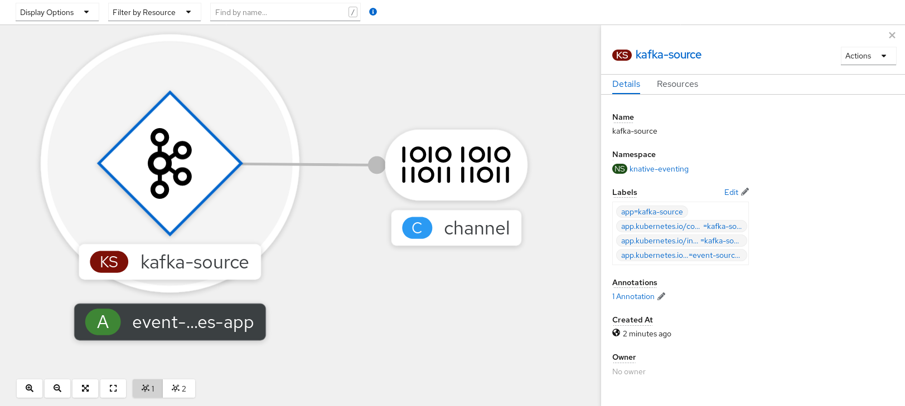

## Introduction

Welcome back to MeatyBytes.io! In our previous post, we introduced OpenShift Serverless and Knative, and discussed their potential use cases. Today, we're going to take a step further and provide a practical guide on how to implement an event-driven application using these technologies.

For our example, we'll create an application that triggers when data is present from OpenShift Streams in a Zigbee topic, and passes the data to a smart home VM in OpenShift Virtualization. This is a typical use case for event-driven applications in the IoT space, and it will give us a chance to explore some of the key features of Knative and OpenShift.

Let's get started!

## Setting Up the Environment

Before we can start building our application, we need to set up our environment. This involves installing OpenShift Serverless and OpenShift Virtualization on our OpenShift cluster, and setting up OpenShift Streams to receive data from our Zigbee devices.

If you haven't already installed OpenShift Serverless and OpenShift Virtualization, refer to our previous post for detailed instructions. For OpenShift Streams, you can follow the official [OpenShift Streams documentation](https://docs.openshift.com/container-platform/4.13/serverless/eventing/event-sources/serverless-kafka-developer-source.html).

## Creating the Event Source

Our event-driven application will be triggered by events from a Zigbee topic in OpenShift Streams. To create this event source, we'll use the `KafkaSource` custom resource provided by Knative.

Here's a sample YAML configuration for our event source:

```yaml
apiVersion: sources.knative.dev/v1beta1
kind: KafkaSource
metadata:
  name: zigbee-source
  namespace: default
spec:
  serviceAccountName: default
  mode: Resource
  resources:
  - apiVersion: v1
    kind: Event
    controller: true
  sink:
    ref:
      apiVersion: serving.knative.dev/v1
      kind: Service
      name: zigbee-handler
```

This configuration creates an event source that watches for `Event` resources in the `default` namespace and sends them to a Knative Service named `zigbee-handler`.



## Creating the Event Handler

Next, we need to create the `zigbee-handler` service that will receive events from our event source and pass the data to our smart home VM. This involves creating a new Knative Service with a corresponding container image.

Here's a sample YAML configuration for our service:

```yaml
apiVersion: serving.knative.dev/v1
kind: Service
metadata:
  name: zigbee-handler
  namespace: default
spec:
  template:
    spec:
      containers:
      - image: quay.io/meatybytes/zigbee-handler:latest
```

This configuration creates a new Knative Service named `zigbee-handler` that runs a container based on the `quay.io/meatybytes/zigbee-handler:latest` image. This image should contain the logic for handling Zigbee events and passing the data to our smart home VM.

## Connecting to the Smart Home VM

To pass data to our smart home VM, we'll need to create a Service and a Route in OpenShift. The Service will expose our VM's network interface, and the Route will provide a URL that

our `zigbee-handler` service can use to send data to the VM.

Here's a sample YAML configuration for our Service:

```yaml
apiVersion: v1
kind: Service
metadata:
  name: smart-home-vm
  namespace: default
spec:
  selector:
    kubevirt.io/domain: smart-home-vm
  ports:
  - name: http
    port: 80
    targetPort: 8080
```

And here's a sample YAML configuration for our Route:

```yaml
apiVersion: route.openshift.io/v1
kind: Route
metadata:
  name: smart-home-vm
  namespace: default
spec:
  to:
    kind: Service
    name: smart-home-vm
```

These configurations create a Service and a Route for our smart home VM, which is assumed to be running in the `default` namespace with the name `smart-home-vm`.

## Conclusion

And there you have it! We've created an event-driven application that triggers when data is present from OpenShift Streams in a Zigbee topic, and passes the data to a smart home VM in OpenShift Virtualization. This is just one example of the many powerful applications you can build with OpenShift Serverless and Knative.

As always, if you have any questions or run into any issues, don't hesitate to reach out. Happy coding!

## References

For additional reading, check out the following resources:

1. [Knative Documentation](https://knative.dev/docs/)
2. [Process Apache Kafka records with Knative's serverless architecture | Red Hat Developer](https://developers.redhat.com/articles/2022/03/14/process-apache-kafka-records-knatives-serverless-architecture)
3. [OpenShift Serverless Documentation](https://docs.openshift.com/container-platform/4.13/serverless/about/about-serverless.html)
4. [OpenShift Virtualization Documentation](https://docs.openshift.com/container-platform/4.13/virt/about-virt.html)
5. [OpenShift Streams Documentation](https://docs.openshift.com/container-platform/4.13/serverless/eventing/event-sources/serverless-kafka-developer-source.html)
