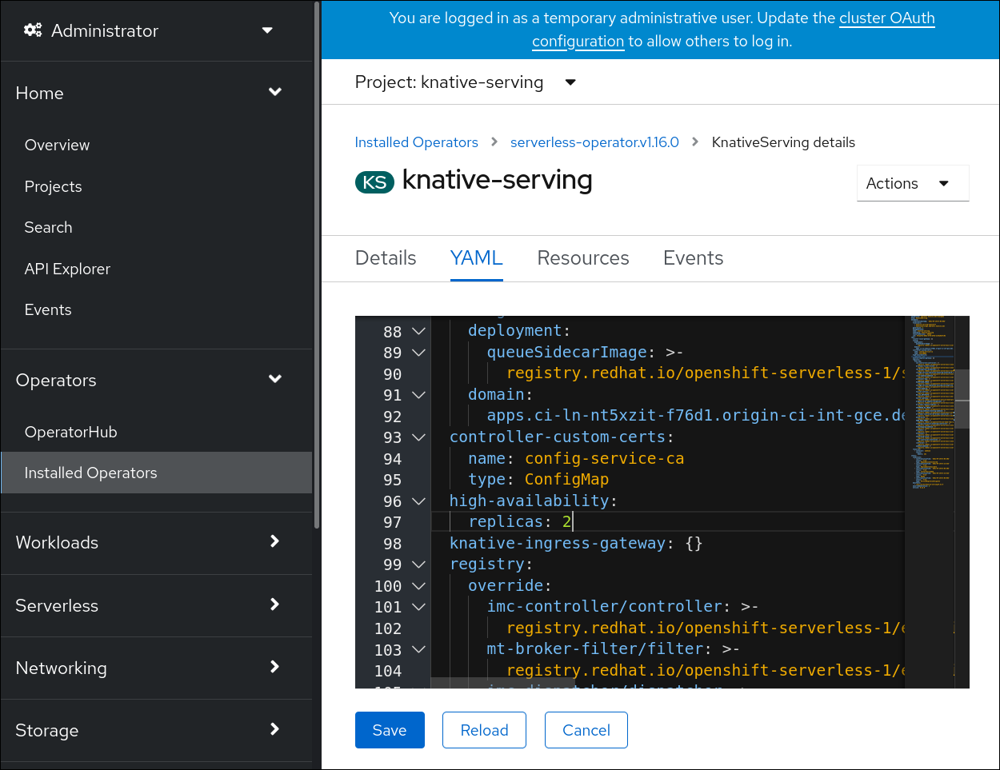

## Introduction

Welcome back to [MeatyBytes](https://meatybytes.io)! Today, we're going to delve into the world of **OpenShift Serverless**, a Red Hat offering based on the open source project [**Knative**](https://knative.dev/). This powerful technology is changing the way we think about deploying and managing applications, and it's an integral part of the OpenShift ecosystem.

In this post, we'll explore what Knative is, its use cases, how it integrates with OpenShift, and how it stacks up against other serverless offerings on the market. We'll also provide a detailed explanation of the technologies used by Knative and their purpose. Finally, we'll walk you through the process of deploying Knative using Ansible and the Operator Hub, and discuss the types of workloads it might be used for.

## What is Knative and What Should It Be Used For?

")

**Knative** is an open-source platform that extends Kubernetes to provide a set of middleware components for deploying, running, and managing serverless, cloud-native applications. It's designed to simplify the process of building, deploying, and managing applications by abstracting away much of the underlying infrastructure.

Knative is ideal for deploying applications that need to scale up quickly in response to demand and then scale back down when demand subsides. This makes it perfect for event-driven applications, real-time data processing, and microservices.

## How Does Knative Integrate with OpenShift?

OpenShift Serverless, powered by Knative, is a fully integrated part of the OpenShift ecosystem. It leverages the power of Kubernetes and the simplicity of Knative to provide a seamless serverless experience.

OpenShift Serverless provides a unified developer experience by integrating with OpenShift's developer console, CLI, and APIs. It also integrates with OpenShift's built-in monitoring, logging, and security features, providing a comprehensive serverless solution.

")

## Competing Offerings and How Knative Compares

There are several other serverless offerings on the market, including AWS Lambda, Google Cloud Functions, and Azure Functions. While these services offer similar functionality, there are key differences that set Knative apart.

* **AWS Lambda**: While Lambda is a robust and popular serverless platform, it's tied to the AWS ecosystem. Knative, on the other hand, is open-source and can run on any Kubernetes cluster, providing more flexibility.
* **Google Cloud Functions**: Like Lambda, Cloud Functions is tied to its respective cloud provider. Additionally, Knative was actually developed by Google and offers more advanced features, such as eventing and custom resource definitions (CRDs).
* **Azure Functions**: Azure Functions provides a wide range of triggers and bindings, but it lacks the Kubernetes-native approach of Knative. With Knative, you can leverage the power and flexibility of Kubernetes, including its robust ecosystem of extensions and integrations.

## Technologies Used by Knative and Their Purpose

Knative is made up of several key components, each serving a specific purpose:

* **Serving**: This component automatically scales your workloads in response to traffic. It also provides routing and network programming for Istio, and revision snapshots of deployed code and configurations.
* **Eventing**: This component provides event-driven capabilities, allowing you to consume and produce events that trigger functions.
* **Build**: This component (now deprecated and replaced by Tekton) was used to build and package your applications from source code into container images and deploy them to a Kubernetes cluster.
* **Tekton**: This is a powerful and flexible open-source framework for creating CI/CD systems, allowing developers to build, test, and deploy across multiple cloud providers or on-premises systems without the need for third-party plugins.

## Deploying Knative with Ansible and the Operator Hub

Deploying Knative on OpenShift can be done using Ansible or the Operator Hub. Here's a brief overview of both methods:

### Ansible

Ansible is an open-source automation tool that can be used to deploy Knative. Here's a basic Ansible playbook that installs Knative:

```yaml
- hosts: openshift_cluster
  tasks:
    - name: Install Knative
      command: oc apply -f https://github.com/knative/serving/releases/download/v0.26.0/serving-crds.yaml
      command: oc apply -f https://github.com/knative/serving/releases/download/v0.26.0/serving-core.yaml
```

This playbook applies the necessary YAML files to install Knative on your OpenShift cluster. You'll need to replace `openshift_cluster` with the appropriate hosts in your Ansible inventory.

### Operator Hub

The Operator Hub is a feature of OpenShift that allows you to install and manage Kubernetes native applications in a simple, straightforward manner. To install Knative using the Operator Hub, follow these steps:

1. Navigate to the OpenShift web console and select "OperatorHub" from the left-hand menu.
2. Search for "OpenShift Serverless Operator" and click on it.
3. Click "Install" and follow the prompts to install the operator.

Once the operator is installed, you can use it to install Knative on your OpenShift cluster.



## Use Cases for Knative

Knative is incredibly versatile and can be used for a wide range of workloads. Here are a few examples:

* **Event-driven applications**: Knative's eventing component makes it easy to build applications that respond to events from a variety of sources.
* **Real-time data processing**: Knative's ability to scale up and down in response to demand makes it perfect for processing large volumes of data in real time.
* **Microservices**: Knative's serving component provides a simple, scalable way to deploy and manage microservices.

## Conclusion

OpenShift Serverless, powered by Knative, is a powerful tool for deploying and managing serverless, cloud-native applications. Its integration with OpenShift and its ability to run on any Kubernetes cluster set it apart from other serverless offerings. Whether you're building event-driven applications, processing real-time data, or deploying microservices, Knative has you covered.

## References

For additional reading, check out the following resources:

1. [Knative Documentation](https://knative.dev/docs/)
2. [OpenShift Serverless Documentation](https://docs.openshift.com/container-platform/4.13/serverless/about/about-serverless.html)
3. [Create an OpenShift Serverless Function | Red Hat Developer](https://developers.redhat.com/developer-sandbox/activities/create-openshift-serverless-function)
4. [Knative: Serving your Serverless Services](https://cloud.redhat.com/blog/knative-serving-your-serverless-services)
5. [Ansible Documentation](https://docs.ansible.com/)
6. [Operator Hub Documentation](https://docs.openshift.com/container-platform/4.13/operators/understanding/olm-understanding-operatorhub.html)
